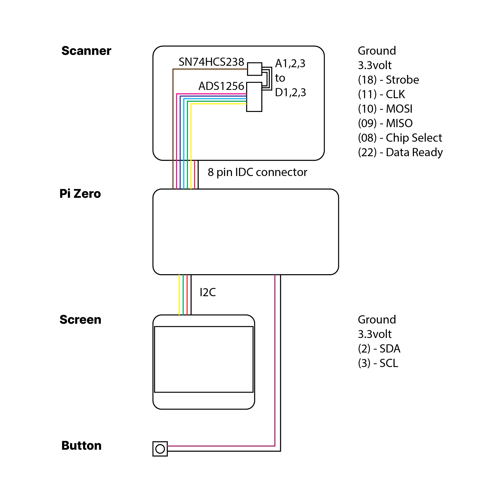

# Plastic Scanner.
This project aims to develop a simple handheld scanner that can detect five different types of plastic. At the end of the project, everything will be shared online so that also you can make one!

The working principle is based on [this paper](https://www.researchgate.net/publication/337868860_Identification_of_Plastic_Types_Using_Discrete_Near_Infrared_Reflectance_Spectroscopy) and [this repo](https://github.com/arminstr/reremeter) by Straller and Gessler.

More information van be found on [PlasticScanner.com](https://plasticscanner.com)

 
Hardware used in the project is under development but the goal is to run it on the following hardware:

- [Raspberry pi zero W](https://www.raspberrypi.org/products/raspberry-pi-zero-w/)
- [ADS1256 Analog to digital converter](https://www.ti.com/product/ADS1256)
- [SN74HCS238 Demultiplexer](https://www.ti.com/product/SN74HCS238)
- [OLED screen](https://www.adafruit.com/product/938)
- Button

 

In the end there need to be two scripts
1. A program that can run on the raspberry pi that can do the prediction
2. A program that trains the model based on sample data

 
the first program needs to do the following thing:

- show simple information on an OLED screen
- start scanning when button is pressed
- pulse LED's with a specific pattern one by one
- measure brightness when LED's flash
- preprocess data, clean it and normalize
- Save measured values for later model training
- predict plastic based on model
- show result on screen.
